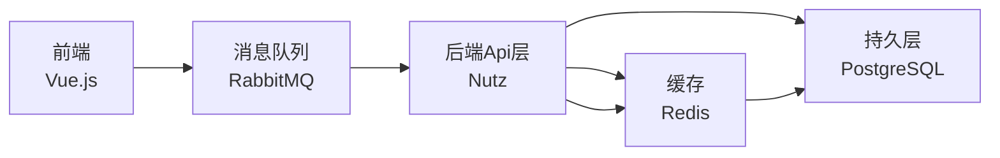

## Todo

#### 1. 后端具体技术栈

- [x] Core: Nutz
- [ ] Logging: Log4j2 + Slf4j
- [ ] Authentication: Sa Token
- [ ] Database: PostgreSQL
- [ ] Cache: Redis
- [ ] Session: Redis
- [ ] File Storage: Minio
- [ ] *Message Queue: RabbitMQ*
- [ ] *特殊功能: OAuth2.0*

#### 2. 前端具体技术栈

- [ ] Core: Vue.js
- [ ] HTTP Request: Axios

---

## 结构

### 后端
